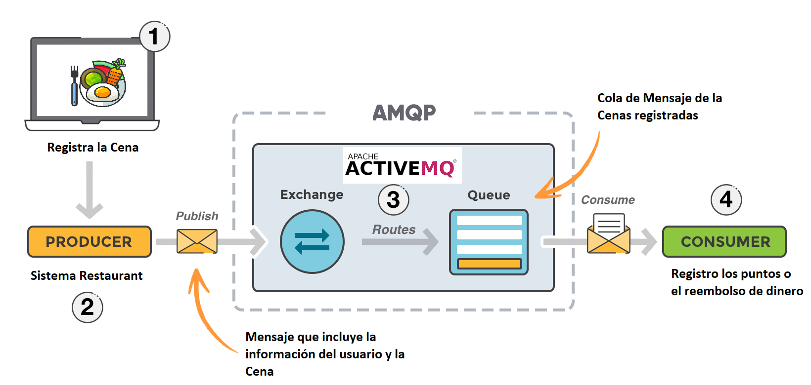
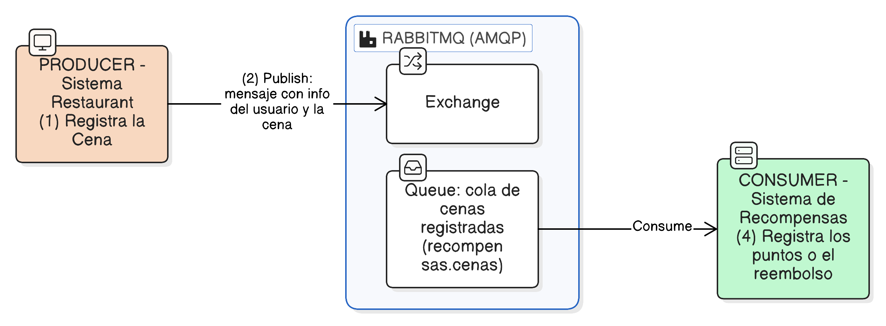
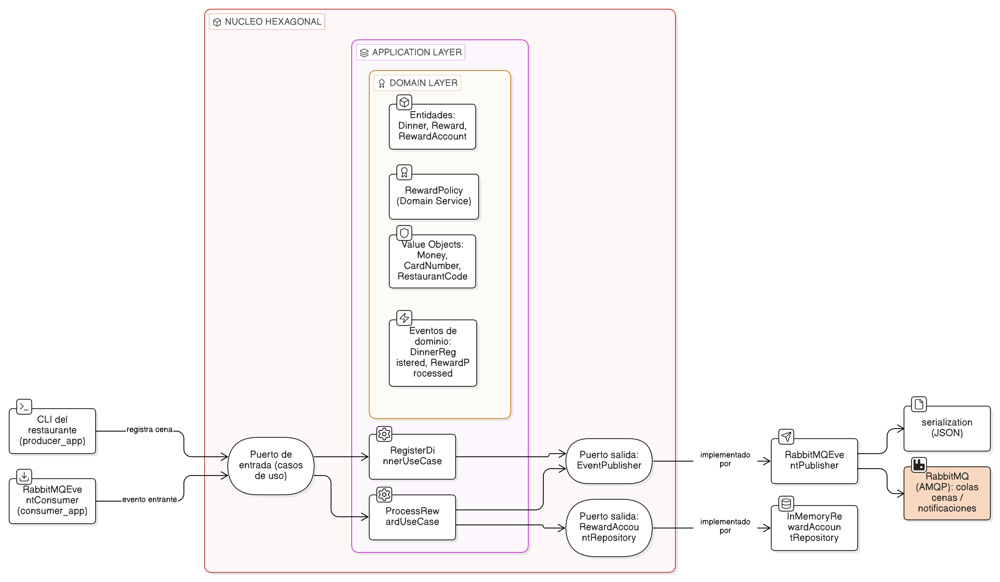
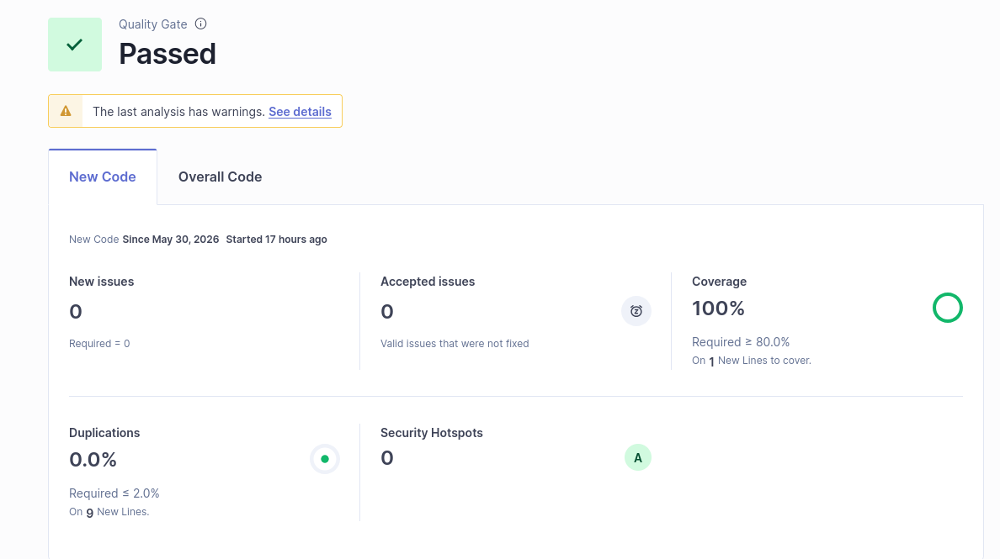
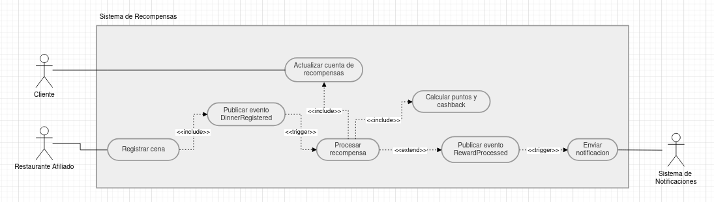

# Documento de Arquitectura — Programa de Recompensas de Restaurantes

**Curso:** CS3081 - Ingeniería de Software ·

**Tarea**: Laboratorio 8

**Estudiante**: Nayeli Guerrero Gutierrez - 202410790


## 1. Resumen

Sistema que transforma el consumo de un cliente en un restaurante afiliado en
**puntos y cashback**, siguiendo una **arquitectura orientada a eventos (EDA)**
sobre **RabbitMQ** y organizada internamente con **Arquitectura Hexagonal**
(puertos y adaptadores).

El flujo implementa exactamente el proceso de la **Figura 1** del enunciado:



*Figura 1. Proceso del programa de recompensas (enunciado).*

Reproducción del proceso de la **Figura 1** del enunciado (con RabbitMQ/AMQP en
lugar de ActiveMQ): productor que registra la cena → `Publish` del mensaje con la
información del usuario y la cena → `Exchange` enruta a la `Queue` → el consumidor
registra los puntos o el reembolso.



*Figura 2. Proceso implementado con RabbitMQ/AMQP.*

## 2. Patrón arquitectónico: Hexagonal + EDA

**Por qué Hexagonal + EDA.** El enunciado exige alta cohesión, bajo acoplamiento,
modularidad y escalabilidad sobre un escenario de mensajería. Se eligió
**Arquitectura Orientada a Eventos** (sobre RabbitMQ) porque desacopla al productor
(restaurante) del consumidor (recompensas): se comunican solo por un evento en una
cola, lo que permite escalar y añadir consumidores sin tocar al productor. Y se eligió
**Arquitectura Hexagonal** para aislar la lógica de negocio de la infraestructura
mediante puertos y adaptadores, logrando bajo acoplamiento, alta testabilidad y la
posibilidad de cambiar el broker o la persistencia sin afectar el dominio. Ambos
patrones son los recomendados por el enunciado y se complementan: EDA resuelve la
comunicación; Hexagonal, la organización interna.

La regla de dependencia es estricta: **todo apunta hacia el dominio**. La
infraestructura depende de la aplicación y el dominio; nunca al revés.

```
┌───────────────────────────────────────────────────────────────┐
│  infrastructure/  (adaptadores: RabbitMQ, persistencia, config) │
│   ┌───────────────────────────────────────────────────────┐   │
│   │  application/  (casos de uso: orquestación)            │   │
│   │   ┌───────────────────────────────────────────────┐   │   │
│   │   │  domain/  (modelo, eventos, política, PUERTOS) │   │   │
│   │   └───────────────────────────────────────────────┘   │   │
│   └───────────────────────────────────────────────────────┘   │
└───────────────────────────────────────────────────────────────┘
        ▲ apps/ (composition root: ensambla las dependencias)
```

El siguiente diagrama (Eraser) muestra la arquitectura **real** en la notación de
**puertos y adaptadores**: los *driving adapters* (inbound) a la izquierda —`CLI`
del restaurante y `RabbitMQEventConsumer`—, el **núcleo hexagonal** al centro
(capa de aplicación con los casos de uso, rodeando a la capa de dominio con
entidades, `RewardPolicy`, *value objects* y eventos), y los *driven adapters*
(outbound) a la derecha —`RabbitMQEventPublisher`, `serialization` e
`InMemoryRewardAccountRepository`— conectados a través de los **puertos**. Las
dependencias siempre apuntan hacia el dominio.



*Figura 3. Arquitectura hexagonal (puertos y adaptadores).*

### Puertos (interfaces) y adaptadores (implementaciones)

| Puerto (dominio) | Adaptador (infraestructura) |
|---|---|
| `EventPublisher` | `RabbitMQEventPublisher` |
| `EventConsumer` | `RabbitMQEventConsumer` |
| `RewardAccountRepository` | `InMemoryRewardAccountRepository` |

Gracias a esta inversión de dependencias, el dominio **no conoce RabbitMQ**:
cambiar el broker (a Kafka o ActiveMQ) o la persistencia (a PostgreSQL) solo
requiere escribir un nuevo adaptador, sin tocar la lógica de negocio.

## 3. Cómo se cumplen los atributos de calidad

- **Alta cohesión:** cada módulo tiene una sola responsabilidad. La regla de
  fidelización vive únicamente en `RewardPolicy`; la validación de datos, en los
  objetos de valor (`Money`, `CardNumber`, `RestaurantCode`).
- **Bajo acoplamiento:** las capas se comunican mediante puertos abstractos
  (`Protocol`) y eventos inmutables. Productor y consumidor solo comparten el
  **contrato del evento**, no código.
- **Modularidad:** paquetes independientes (`domain`, `application`,
  `infrastructure`, `apps`) sustituibles de forma aislada.
- **Abstracción:** el núcleo trabaja con conceptos de negocio (cena, recompensa,
  cuenta), no con detalles técnicos.
- **Escalabilidad:** al desacoplar mediante colas, productor y consumidor escalan
  de forma independiente; se pueden añadir más consumidores sobre la misma cola.

## 4. Componentes principales

| Capa | Archivo | Responsabilidad |
|---|---|---|
| Dominio | `value_objects.py` | Invariantes de `Money`, `CardNumber`, `RestaurantCode` |
| Dominio | `model.py` | Entidades `Dinner`, `Reward`, agregado `RewardAccount` |
| Dominio | `events.py` | Eventos `DinnerRegistered`, `RewardProcessed` |
| Dominio | `reward_policy.py` | Cálculo de puntos/cashback (regla de negocio) |
| Dominio | `ports.py` | Contratos (puertos) de la hexagonal |
| Aplicación | `register_dinner.py` | Caso de uso del productor |
| Aplicación | `process_reward.py` | Caso de uso del consumidor |
| Infraestructura | `messaging/` | Adaptadores RabbitMQ (publisher/consumer/conexión) |
| Infraestructura | `persistence/` | Repositorio de cuentas |
| Infraestructura | `serialization.py` | Traducción evento ↔ JSON |
| Apps | `producer_app.py`, `consumer_app.py` | Composition root ejecutable |

## 5. Decisiones de diseño relevantes

- **Seguridad:** el número de tarjeta nunca se expone completo; `CardNumber.masked`
  revela solo los últimos 4 dígitos y el evento `RewardProcessed` se serializa
  enmascarado. Las credenciales se leen de variables de entorno y la contraseña
  se excluye del `repr` de la configuración.
- **Confiabilidad:** los mensajes inválidos se descartan de forma controlada
  (`SerializationError`) sin tumbar el consumidor; las colas se declaran
  `durable=True`.
- **Testabilidad:** la dependencia con `pika` se aísla y se inyecta el canal, lo
  que permite probar los adaptadores con dobles de prueba. El tiempo se inyecta
  mediante un `clock` para obtener pruebas deterministas.

## 6. Calidad y pruebas

- Pruebas automatizadas con `pytest` (**54 pruebas**).
- Cobertura **100 %** (medida con `pytest-cov`, reporte `coverage.xml`; mínimo exigido 85 %).
- Análisis estático y control de duplicidad con **SonarQube** (`sonar-scanner`):
  Reliability A, Security A, Maintainability A, Duplicaciones 0 %, 0 Security Hotspots.

Proyecto en SonarQube:
<https://sonarqube.ingsoftware.lat/dashboard?id=Nayeli_Guerrero_t1>. 

El **Quality
Gate** se encuentra en estado **Passed**:



*SonarQube — Quality Gate "Passed": Coverage 100 %, 0 issues, Duplicaciones 0 %,
0 Security Hotspots (Security A).*

## 7. Diagrama de casos de uso



*Figura 4. Diagrama de casos de uso.*

Actores: **Restaurante Afiliado** y **Cliente** (izquierda), **Sistema de
Notificaciones** (derecha). Se modelan las relaciones `<<include>>`, `<<extend>>`
y el disparo por evento (`<<trigger>>`) entre casos de uso.

## 8. Evidencia de pruebas

- `docs/evidencia/pytest_salida.txt`: salida completa de `pytest -v` (54 pruebas, 100% cobertura).
- `docs/evidencia/cobertura_html/index.html`: reporte navegable de cobertura.
- `docs/evidencia/sonarqube_dashboard.png`: captura del Quality Gate (Passed) en SonarQube.
